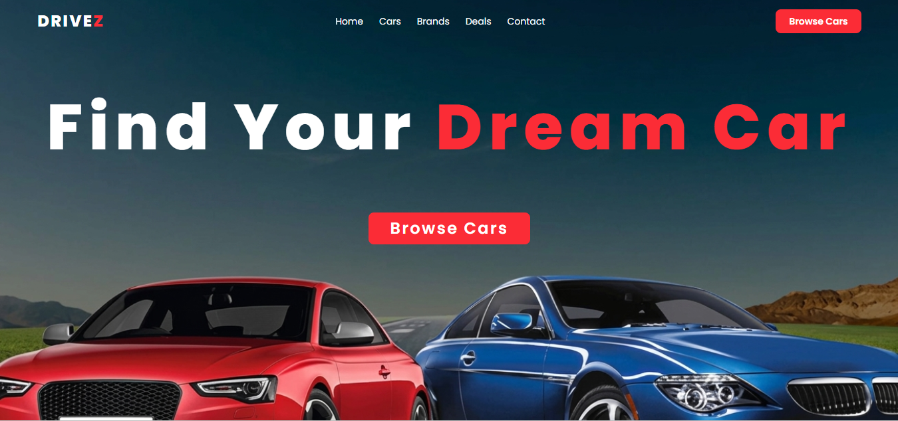

<p align="center">
  
</p>

Car-Showcase - Car Showcase Website

📌 Project Purpose

The purpose of this project is to build a modern and responsive Car Showcase Website where users can easily browse different cars and view detailed information about each one.

This project focuses on creating a clean and user-friendly interface using Next.js and Tailwind CSS. It includes key features like a car listing section, detailed view page, and search and filter functionality to improve user experience.

Overall, the project demonstrates frontend development skills such as component structuring, responsive design, and building interactive UI elements suitable for real-world applications.

🔗 Live Demo

https://car-showcase-livid-seven.vercel.app/

🛠️ Technologies Used

Next js

Tailwind CSS


🚀 Key Features

Modern and responsive Hero Section with heading, background, and CTA button

Dynamic Car Listing with multiple car cards (image, name, price, description)

Detailed Car View page with full image and specifications (engine, mileage, brand, etc.)

Search functionality to find cars by name

Filter option based on price range

Clean and user-friendly UI with proper spacing and alignment

Smooth hover effects and transitions for better user experience

Fully responsive design for mobile, tablet, and desktop

Contact section with basic form (Name, Email, Message)


## ⚙️ Getting Started

Follow these steps to run the project locally:

1. Clone the repository:

   ```bash
   git clone https://github.com/your-username/car-showcase.git
   ```

2. Navigate to the project folder:

   ```bash
   cd car-showcase
   ```

3. Install dependencies:

   ```bash
   npm install
   ```

4. Run the development server:

   ```bash
   npm run dev
   ```

5. Open your browser and visit:

   ```
   http://localhost:3000
   ```
